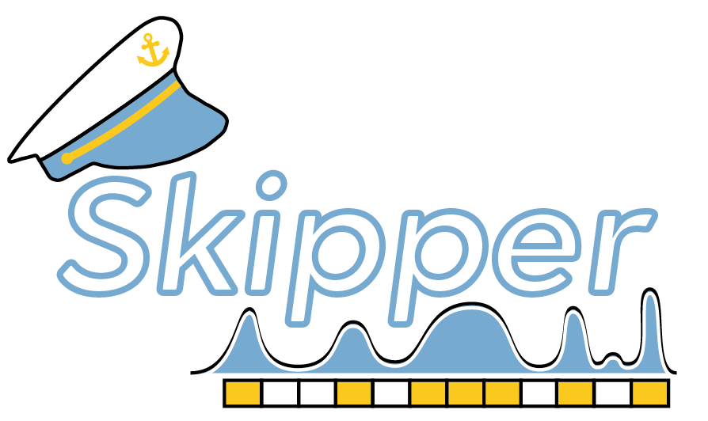

# skipper

Skip the peaks and expose RNA-binding in CLIP data

<h2>Prerequisites</h2>
Skipper requires several executables and packages:

| Tool      | Link |
| ----------- | ----------- |
| R           | https://www.r-project.org/       |
| Python   | https://www.python.org/downloads/        |
| Mamba   | https://mamba.readthedocs.io/en/latest/installation.html#installation        |
| Snakemake   | https://snakemake.readthedocs.io/en/stable/getting_started/installation.html        |
| UMICollapse   | https://github.com/Daniel-Liu-c0deb0t/UMICollapse        |
| STAR   | https://github.com/alexdobin/STAR        |
| Java   | https://www.java.com/en/download/manual.jsp        |

For example, below are some commands for installing Mamba and Snakemake.

`curl -L -O "https://github.com/conda-forge/miniforge/releases/latest/download/Mambaforge-$(uname)-$(uname -m).sh"`

`bash Mambaforge-$(uname)-$(uname -m).sh`

`mamba create -c conda-forge -c bioconda -n snakemake snakemake`

Skipper utilizes a specifically named conda environment - currently the only requirement is samtools:

`mamba create -n snakeclipenv -c bioconda -c conda-forge samtools`

Several R packages are also required:

`install.packages("VGAM", "viridis", "ggrepel", "RColorBrewer", "Rtsne", "ggupset", "ggdendro", "cowplot")`

`if (!require("BiocManager", quietly = TRUE))`
    `install.packages("BiocManager")`
`BiocManager::install(c("GenomicRanges","fgsea"))`

Paths to locally installed versions can be supplied in the config file, described below.

<h2>Preparing to run Skipper</h2>
Skipper uses a Snakemake workflow. The `Skipper.py` file contains the rules necessary to process CLIP data from fastqs. Skipper also supports running on BAMs - note that Skipper's analysis of repetitive elements will assume that non-uniquely mapping reads are contained within the BAM files.

Providing an absolute path to the GitHub repository `REPO_DIR` will help Snakemake find resources regardless of the directory where Skipper is run.

Numerous resources must be entered in the `Skipper_config.py` file.
| Resource      | Description |
| ----------- | ----------- |
| MANIFEST            | Information on samples to run                                                        |
| GFF                 | Gene annotation to partition the transcriptome and count reads                       |
| ACCESSION_RANKINGS  | A ranking of gene and transcript types to facilitate the transcriptome partitioning  |
| REPEAT_TABLE        | Coordinates of repetitive elements, available from UCSC Genome Browser               |
| GENOME              | Indexed fasta of genome                                                              |

Other paths must be entered 
| Path    | Description |
| ----------- | ----------- |
| CONDA_DIR   | Parent directory for Mamba or Conda installation: usually in the home directory, eg `~/mambaforge`             |
| EXE_DIR     | For convenience to point to stable locally installed software: it is added to your Path when Skipper runs |
| TOOL_DIR    | Directory for the tools located in the GitHub        |

Information about the CLIP library to be analyzed is also required.

| Setting      | Description |
| ----------- | ----------- |
| UMI_SIZE            | Bases to trim for deduplication (10 for current eCLIP)       |
| INFORMATIVE_READ    | Which read (1 or 2) reflects the crosslink site (for Paired End runs)        |
| OVERDISPERSION_MODE | Overdispersion can be estimated from multiple input replicates ("input") or multiple CLIP replicates ("clip"): "input" is recommended |

<h2>Making a manifest</h2>

| Column      | Description |
| ----------- | ----------- |
| Experiment       | CLIP samples will be compared against Input samples within an experiment. The same sample can be used in multiple experiments |
| Sample           | Each CLIP and Input sample will be processed separately until testing for differential binding   |
| Cells            | A place to record information on the cell sample used: this is not currently used in analysis  |
| Input_replicate  | Replicate # for the same Sample. The same Input replicate (fastq and number) can be used for multiple CLIP replicates |
| Input_adapter    | Fasta of adapter sequences for Input replicate                                                     |
| Input_fastq      | Path to Input replicate fastq (multiple files can be entered per cell to be concatenated            |
| CLIP_replicate   | Replicate # for the same Sample. Distinct CLIP replicates are required |
| CLIP_adapter     | Fasta of adapter sequences for CLIP replicate                                                     |
| CLIP_fastq       | Path to CLIP replicate fastq (multiple files can be entered per cell to be concatenated            |

See the example manifest for the exact formatting and to test running Skipper.

<h2>Running Skipper</h2>

Skipper can be run like any other Snakemake workflow. 

Create a new directory to store output, copy the Snakemake and config files, and make all edits necessary to the config file. In the `all` rule of the `Skipper.py` file, comment out output that you do not wish to inspect.

Remember to load the Snakemake environment before running

`mamba activate snakemake`

Use the dry run function to confirm that Snakemake can parse all the information:

`snakemake -ns Skipper.py -j 1`

Once Snakemake has confirmed DAG creation, submit the jobs using whatever high performance computing infrastructure options suit you:

`snakemake -kps Skipper.py -w 15 -j 30 --cluster "qsub -e {params.error_file} -o {params.out_file} -l walltime={params.run_time} -l nodes=1:ppn={threads} -q home-yeo"`

Did Skipper terminate? Sometimes jobs fail - inspect any error output and rerun the same command if there is no apparent explanation such as uninstalled dependencies or a misformatted input file. Snakemake will try to pick up where it left off.

<h2>Skipper output</h2>

Skipper produces a lot of output. The `output/figures` directory contains figures summarizing the data.
| Output      | Description |
| ----------- | ----------- |
| all_reads       | Visualization of RNA region preferences based on total reads instead of called windows |
| threshold_scan  | Visualization of selection of minimum read coverage for statistical testing  |
| input_distributions | Visualization of betabinomial fits to aggregate data |
| enriched_windows | QC of called enriched windows  |
| enrichment_concordance  | Mosaic plot of agreement between called enriched windows between replicates |
| enrichment_reproducibility  | Number of total and enriched windows as a function of the number of replicates included  |
| reproducible_enriched_windows | Visualization of RNA region preferences for windows called by at least two replicates   |
| gene_sets        | Visualization of top enriched GO terms relative to ENCODE reproducible enriched windows   |
| clip_scatter_re  | Visualization of enriched repetitive elements   |
| tsne       | t-SNE visuzliation of binding preferences releative to ENCODE RBPs   |

Annotated reproducible enriched windows can be accessed at `output/reproducible_enriched_windows/` and Homer motif output is at `output/homer/`
